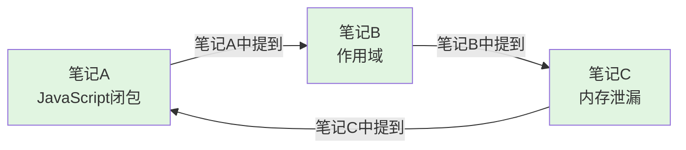
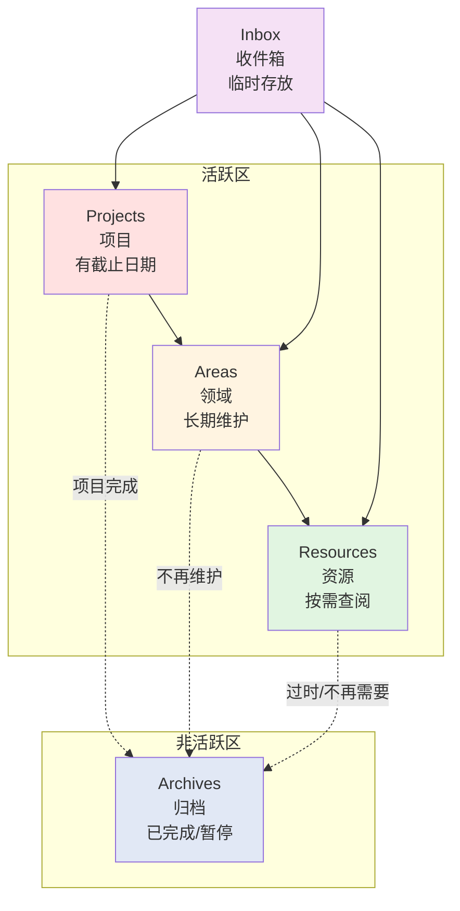
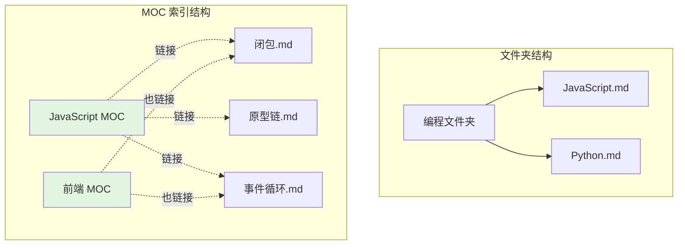

# 核心进阶功能与笔记组织方法论

> 本部分介绍 Obsidian 自带的核心进阶功能，以及三种主流的笔记组织方法论。

---

## 第六章：核心进阶功能（Obsidian 自带功能）

### 6.1 双向链接与知识图谱

双向链接是 Obsidian 区别于普通 Markdown 编辑器的核心特性，也是其被称为"知识管理神器"的关键原因。

#### 创建双向链接

在笔记中输入 `[[笔记名]]` 即可创建一个链接。如果目标笔记存在，点击即可跳转；如果不存在，Obsidian 会以灰色显示链接文字，点击后会自动创建该笔记。

```markdown
我正在学习 [[Obsidian]]，它是一款非常强大的 [[笔记工具]]。
```

如果链接的笔记标题太长，你可以自定义显示文字：

```markdown
[[Obsidian 使用教程 | 点击这里查看教程]]
```

#### 链接的预览

将鼠标悬停在链接上（按住 `Ctrl/Cmd`），Obsidian 会弹出一个小窗口预览目标笔记的内容，无需跳转即可快速查看。这个功能在查阅参考资料时非常实用。

#### 反向链接（Backlinks）

当你在一篇笔记 A 中链接到笔记 B 时，Obsidian 会自动在笔记 B 中记录："笔记 A 链接到了我"。

查看方式：
1. 打开笔记 B
2. 在右侧边栏或底部找到"反向链接"面板
3. 你会看到所有链接到笔记 B 的笔记列表

这意味着你可以随时回答一个问题："这篇笔记被哪些地方引用了？"

#### 未链接提及（Unlinked mentions）

反向链接面板还会显示"未链接提及"——即正文中提到了某笔记的名字，但没有用 `[[ ]]` 创建正式链接的地方。你可以一键将这些提及转换为正式链接。

这个功能帮助你发现隐性的知识关联。

#### 关系图谱（Graph View）

关系图谱将 Vault 中所有笔记的连接关系可视化展示。

**打开方式**：
- 点击左侧边栏的关系图谱按钮
- 或使用命令面板搜索 "打开关系图谱"

**全局图谱**：展示整个 Vault 中所有笔记和它们之间的链接。你可以：
- 拖拽节点调整位置
- 点击节点打开对应笔记
- 放大/缩小查看局部或整体
- 在设置中调整节点颜色（按标签或文件夹着色）

**局部图谱**：只展示与当前笔记直接相关的笔记网络。在笔记右上角点击图谱图标即可打开。

关系图谱的价值不在于"好看"，而在于帮助你：
- 发现知识间的隐藏关联
- 识别知识孤岛（没有链接的孤立笔记）
- 发现知识枢纽（被大量笔记引用的核心笔记）

#### 出链与入链

在关系图谱的设置中，你可以选择显示：
- **出链（Outgoing links）**：当前笔记链接到了哪些笔记
- **入链（Incoming links）**：哪些笔记链接到了当前笔记
- **两者都显示**

通过调节显示深度，你可以查看"一度关联"（直接链接）或"二度关联"（链接的链接）。

**双向链接示意图**：



当笔记 A 链接到笔记 B 时，Obsidian 会自动在笔记 B 的"反向链接"面板中显示笔记 A 的引用。这就是"双向"的含义。

### 6.2 Canvas 画布功能

Canvas（画布）是 Obsidian 自带的无限白板功能，你可以在上面自由摆放笔记卡片、图片、网页和手写内容，并用线条连接它们。

#### 创建 Canvas

1. 在文件列表中右键 → 新建 Canvas
2. 或使用命令面板搜索 "新建画布"

#### 基本操作

**添加卡片**：
- 在空白处双击，创建文本卡片
- 从文件列表拖拽笔记到画布，创建笔记卡片
- 拖拽图片到画布
- 粘贴网页链接，创建网页嵌套卡片

**连接卡片**：
- 将鼠标悬停在卡片边缘，会出现连接点
- 拖拽连接点到另一个卡片，建立连接线
- 点击连接线可添加标签文字

**排版操作**：
- 拖拽卡片调整位置
- 框选多个卡片批量移动
- 使用对齐工具（顶部工具栏）整齐排列

#### 典型使用场景

1. **头脑风暴**：把零散的想法写在卡片上，自由排列组合，发现新的思路
2. **项目规划**：用卡片表示任务，用连线表示依赖关系，形成项目流程图
3. **知识梳理**：将一个主题相关的多篇笔记放在画布上，直观展示知识结构
4. **写作大纲**：用卡片组织文章结构，拖拽调整章节顺序
5. **流程图绘制**：用卡片和箭头绘制各种流程图

#### 与笔记的关联

Canvas 文件本身也是保存在 Vault 中的 `.canvas` 文件。你可以：
- 在普通笔记中链接到 Canvas：`[[我的画布.canvas]]`
- 在 Canvas 中嵌入普通笔记卡片
- 这样 Canvas 和笔记之间形成了双向连接

### 6.3 工作区（Workspace）管理

工作区功能让你可以保存和恢复不同的面板布局。

#### 为什么需要工作区

你可能在不同场景下需要不同的布局：

- **写作模式**：中间是编辑区，右侧打开大纲
- **阅读模式**：全屏预览，关闭所有侧边栏
- **研究模式**：左侧打开文件列表，中间打开笔记，右侧打开局部图谱
- **对照模式**：左右分屏，同时打开两篇笔记

手动调整布局很麻烦，工作区可以一键切换。

#### 保存工作区

1. 将面板调整到你想要的布局
2. 打开命令面板，搜索 "管理工作区布局"
3. 点击 "保存"，输入工作区名称

#### 切换工作区

1. 打开命令面板，搜索 "管理工作区布局"
2. 选择要加载的工作区
3. 面板布局会自动恢复

#### 与 Git 的配合

工作区布局保存在 `.obsidian/workspace.json` 中。这个文件会被频繁修改，且不同设备上的布局偏好可能不同。

建议将以下两行加入 `.gitignore`：

```gitignore
.obsidian/workspace.json
.obsidian/workspace-mobile.json
```

这样 Git 不会同步布局文件，避免多端冲突。

---

## 第七章：笔记组织方法论（通用方法）

掌握工具之后，更重要的是建立一套适合自己的笔记组织方法论。以下是三种在 Obsidian 社区中最流行的方法。

### 7.1 PARA 方法

PARA 是由 Tiago Forte 提出的一套通用信息组织框架，适用于任何笔记工具。

PARA 代表四个分类：

#### Projects（项目）

**定义**：当前正在进行的、有明确目标和截止日期的任务。

特征：
- 有明确的开始和结束时间
- 有具体的交付成果
- 通常需要多个步骤完成

示例：
- 写一篇论文
- 开发一个网站
- 准备一场演讲
- 学习一门课程并通过考试

在 Obsidian 中，可以为每个项目创建一个项目笔记，记录项目目标、进度、相关资源。

#### Areas（领域）

**定义**：需要长期维护的责任领域，没有明确的结束时间。

特征：
- 持续进行，没有终点
- 需要定期投入时间和精力
- 有标准需要维持

示例：
- 健康与健身
- 财务管理
- 职业发展
- 人际关系
- 技能提升

在 Obsidian 中，领域笔记用于记录该领域的标准、目标、例行事项和反思。

#### Resources（资源）

**定义**：感兴趣的主题和参考材料，以备将来使用。

特征：
- 被动收集，按需查阅
- 不需要立即行动
- 有潜在价值

示例：
- 编程语言参考
- 设计灵感收集
- 旅行攻略
- 菜谱合集
- 读书笔记

在 Obsidian 中，资源笔记是最常见的笔记类型，按照主题分类存放。

#### Archives（归档）

**定义**：已完成或暂停的项目和领域。

特征：
- 不再活跃，但可能有参考价值
- 项目完成后移入归档
- 领域长期不维护也移入归档

归档不是删除，而是"冷冻"。当需要时，你可以随时从归档中恢复。

#### PARA 在 Obsidian 中的实践

建议的文件夹结构：

```
Vault/
├── 00-Inbox/          # 收件箱，临时存放新笔记
├── 01-Projects/       # 项目
│   ├── 写一篇论文/
│   └── 开发网站/
├── 02-Areas/          # 领域
│   ├── 健康/
│   ├── 财务/
│   └── 职业/
├── 03-Resources/      # 资源
│   ├── 编程/
│   ├── 设计/
│   └── 阅读/
├── 04-Archives/       # 归档
│   ├── 已完成项目/
│   └── 旧领域/
└── 99-Templates/      # 模板
```

**PARA 结构示意图**：



> **流动原则**：笔记在不同分类间流动。新想法先放入 Inbox，整理后进入 Projects/Areas/Resources，完成或过期后移入 Archives。

### 7.2 MOC（Map of Content）内容地图

MOC 是 Obsidian 社区发展出的一种导航结构，用于解决文件夹层级僵化的问题。

#### 什么是 MOC

MOC 是一篇特殊的笔记，作为某个主题的**导航入口**。它汇总了该主题下的所有相关笔记、链接和资源，像一个"目录页"或"索引页"。

#### 为什么需要 MOC

传统的文件夹结构有一个问题：一个笔记只能放在一个文件夹里。但知识是多维的，一个关于"React Hooks"的笔记，既属于"编程"，也属于"前端"，还可能与"项目A"相关。

MOC 不移动笔记的位置，而是创建一个"地图"来组织它们。

#### MOC 示例

假设你有很多关于 JavaScript 的零散笔记，你可以创建一个 MOC：

```markdown
# JavaScript MOC

## 基础概念
- [[变量与作用域]]
- [[数据类型]]
- [[原型链]]

## ES6+ 新特性
- [[箭头函数]]
- [[解构赋值]]
- [[Promise 与异步编程]]

## 进阶主题
- [[闭包]]
- [[事件循环]]
- [[内存管理]]

## 相关 MOC
- [[前端开发 MOC]]
- [[编程语言 MOC]]
```

#### MOC vs 文件夹

| | 文件夹 | MOC |
|--|--------|-----|
| 本质 | 物理分类 | 逻辑索引 |
| 灵活性 | 一个笔记只能在一个文件夹 | 一个笔记可以出现在多个 MOC |
| 导航 | 层级浏览 | 网状跳转 |
| 适用场景 | 固定分类 | 主题聚合 |

建议组合使用：用文件夹做粗略的 PARA 分类，用 MOC 做精细的主题导航。

**MOC 概念示意图**：



> MOC 的核心思想：笔记物理位置不变，通过索引笔记（MOC）建立多维的知识关联。一篇笔记可以被多个 MOC 引用，打破"一个笔记只能在一个文件夹"的限制。

### 7.3 原子笔记（Atomic Notes）

原子笔记是知识管理领域的一个重要概念，最早由德国社会学家 Niklas Luhmann 提出。

#### 什么是原子笔记

**原子笔记 = 每条笔记只记录一个核心概念或想法**

就像化学中的"原子"是构成物质的最小单位，原子笔记是构成知识体系的最小单位。

#### 原子笔记的特征

1. **单一性**：一条笔记只讲一件事
   - 不是"JavaScript 学习笔记"（包含几十个点）
   - 而是"JavaScript 闭包的定义与用法"（只讲闭包）

2. **自包含**：笔记本身应该是完整的，无需依赖上下文就能理解
   - 包含概念的定义
   - 包含自己的例子
   - 包含与其他概念的关系

3. **可连接**：通过链接与其他原子笔记建立关联
   - "闭包"链接到"作用域"
   - "闭包"链接到"内存泄漏"
   - "闭包"链接到"函数式编程"

#### 为什么使用原子笔记

1. **复用性高**：一个关于"闭包"的笔记，可以在学习 JavaScript 时用，在解决面试题时用，在阅读框架源码时用
2. **组合灵活**：通过链接将原子笔记组合成复杂知识，而不是写长篇大论的综合性笔记
3. **便于维护**：发现错误时只需要修改一个原子笔记，所有引用它的地方都会自动更新
4. **促进思考**：将知识拆解到原子级别，迫使你深入理解每个概念的本质

#### 原子笔记的实践建议

1. **新建笔记时问自己**："这篇笔记能不能再拆？"
   - 如果能拆成两篇独立的笔记，那就拆
   - 目标是：每条笔记可以独立成文

2. **笔记标题就是核心概念**
   - 好的标题："闭包（Closure）的定义与应用场景"
   - 不好的标题："JS 学习第 3 天"

3. **用链接代替复制**
   - 不要在笔记 A 中重复笔记 B 的内容
   - 而是在笔记 A 中链接到笔记 B

4. **渐进式总结**
   - 第一次记录时写一个简要版本
   - 后续学习时逐步补充细节和例子
   - 不要追求一次性写出完美的笔记

> **下一部分**：[Git 云同步完整教程](03-Git云同步.md)
>
> 掌握了笔记组织方法后，下一步是确保你的笔记安全且可以在多设备间同步。我们将详细介绍如何通过 Git + GitHub 实现免费的电脑端和手机端同步，包括仓库创建、Git 插件配置、Personal Access Token 生成以及多重备份策略。
