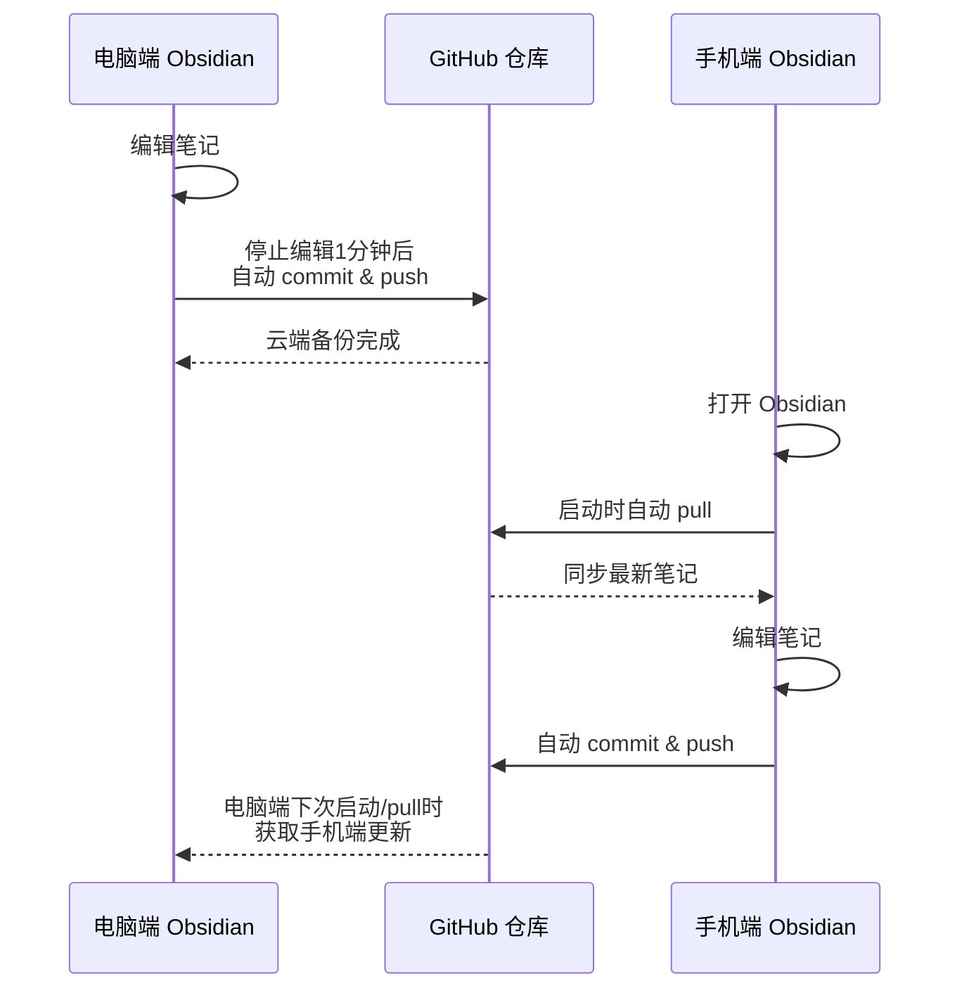

# Git 云同步完整教程

> 本部分详细介绍如何通过 Git + GitHub 实现 Obsidian 的免费多端同步，涵盖电脑端和手机端的完整配置流程。

---

## 第八章：云同步插件 —— Git（第三方，电脑端 + 手机端完整教程）

Obsidian 本身不提供官方的云同步服务（Obsidian Sync 是付费功能）。对于希望免费实现多端同步的用户，使用 Git + GitHub 是一套非常成熟且可靠的方案。

### 8.1 为什么需要云同步

如果你只在单台电脑上使用 Obsidian，本地存储就足够了。但如果你有以下需求，就需要云同步：

- 在公司电脑和家用电脑之间切换工作
- 想在手机上随时查看和编辑笔记
- 希望笔记有云端备份，防止电脑损坏丢失数据

**为什么选择 GitHub**：
- 完全免费（私有仓库也免费）
- GitHub 是世界上最大的代码托管平台，稳定性极高
- Git 版本控制可以记录每一次修改，随时回滚
- 比任何商业云笔记的导出功能都更开放

**Git 同步流程示意图**：



### 8.2 GitHub 仓库准备

#### 注册 GitHub 账号

1. 访问 https://github.com
2. 点击 Sign up，按提示完成注册
3. 建议开启双重验证（2FA）提高安全性

#### 创建私有仓库

1. 登录 GitHub，点击左上角绿色的 **New** 按钮
2. **Repository name**：输入你的仓库名，如 `personal-vault`
3. **Description**（可选）：填写描述，如"我的 Obsidian 笔记库"
4. **Visibility**：选择 **Private**（非常重要，避免笔记公开）
5. 其他选项保持默认，点击 **Create repository**

> 注意：仓库名可以自定义，后续在 Obsidian 中这个仓库名不会影响 Vault 的显示名称。

### 8.3 仓库克隆到本地（电脑端）

#### 安装 GitHub Desktop（推荐新手）

1. 访问 https://desktop.github.com 下载 GitHub Desktop
2. 安装并登录你的 GitHub 账号
3. 点击 **File → Clone repository**
4. 在列表中找到刚才创建的仓库，选择本地保存路径
5. 点击 **Clone**

#### 或用命令行

```bash
git clone https://github.com/你的用户名/personal-vault.git
```

克隆完成后，本地会有一个与仓库同名的文件夹，里面只有一个 `.git` 隐藏文件夹。

### 8.4 在 Obsidian 中打开仓库作为 Vault

1. 打开 Obsidian
2. 选择 **Open folder as vault**
3. 找到刚才克隆到本地的文件夹，点击 **打开**
4. 现在你的 Vault 就是一个 Git 仓库了

### 8.5 Git 基础配置

#### 了解 .obsidian 文件夹

你的 Vault 根目录下有一个 `.obsidian` 文件夹，里面存放着 Obsidian 的所有配置。这个文件夹应该被 Git 追踪，因为它包含你的设置、主题和插件。

但有两个文件需要排除：

- `workspace.json`：记录当前工作区布局
- `workspace-mobile.json`：记录手机端工作区布局

这两个文件会被频繁自动修改，上传到 Git 容易造成冲突。

#### 创建 .gitignore

在 Vault 根目录创建 `.gitignore` 文件，内容如下：

```gitignore
# Obsidian 工作区文件（不同设备布局不同，不需要同步）
.obsidian/workspace.json
.obsidian/workspace-mobile.json

# 可选：如果你不希望同步某些插件数据
.obsidian/plugins/插件名/data.json
```

#### 首次提交

在 GitHub Desktop 中：

1. 你会看到所有变更（包括 .obsidian 文件夹和 .gitignore）
2. 在下方输入提交信息，如 `Initial commit: setup Obsidian vault`
3. 点击 **Commit to main**
4. 点击 **Push origin** 上传到 GitHub

现在你的笔记库已经在 GitHub 上备份了。

### 8.6 Git 插件安装与配置（电脑端）

手动提交太麻烦，我们需要自动化。Obsidian 社区有一个非常流行的 Git 插件，可以实现自动同步。

#### 安装 Git 插件

1. 进入 **设置 → 第三方插件**
2. 关闭安全模式（点击开关，确认风险）
3. 点击 **浏览**，打开社区插件市场
4. 搜索 **Git**，找到由 Denis Olekhov 开发的插件（下载量通常排名第一）
5. 点击 **安装**，然后 **启用**

#### 配置自动同步

进入 **设置 → 第三方插件 → Git → 选项**，配置以下关键项：

**自动备份设置**：
- **Auto commit-and-sync after stopping file edits**：开启
  - 作用：当你停止编辑笔记一段时间后，自动提交并推送
- **Auto commit-and-sync interval (minutes)**：设置为 `1`
  - 作用：停止编辑 1 分钟后自动同步
- **Pull on startup**：开启
  - 作用：启动 Obsidian 时自动从 GitHub 拉取最新内容

**提交与推送设置**：
- **Push on commit-and-sync**：开启
- **Pull on commit-and-sync**：开启
- **Specify custom commit message**：可选，设置自动提交的消息模板，如 `vault backup: {{date}}`

**其他选项**：
- **Auto backup interval**：可以设置为 0（禁用），因为我们使用"停止编辑后同步"更合理
- **Show status bar**：开启，在状态栏显示 Git 状态

配置完成后，每当你停止编辑笔记 1 分钟，Obsidian 会自动：
1. 将所有变更添加到暂存区（git add）
2. 提交变更（git commit）
3. 从 GitHub 拉取更新（git pull）
4. 推送到 GitHub（git push）

你会在右上角看到弹窗提示同步成功。

### 8.7 双向同步验证（电脑端）

#### 测试本地推送

1. 在 Obsidian 中新建一篇笔记，写一些内容
2. 停止编辑，等待 1 分钟
3. 观察右上角是否有 "Committed X files" 和 "Pushed X files" 的弹窗
4. 打开 GitHub 网页，进入你的仓库，确认新笔记已经出现

#### 测试远程拉取

1. 在 GitHub 网页上点击 **Add file → Create new file**
2. 创建一个测试用的 Markdown 文件，如 `github-test.md`
3. 填写内容，点击 **Commit new file**
4. 回到 Obsidian，点击命令面板，搜索 "Git: Pull"
5. 或者重启 Obsidian，触发启动时自动 pull
6. 观察新文件是否出现在文件列表中

### 8.8 手机端初始文件同步

手机端的配置稍微复杂一些，但只需要设置一次。

#### 准备手机端 Vault

1. 用数据线连接手机与电脑
2. 手机上选择 **传输文件** 模式（而不是仅充电）
3. 在电脑上打开手机存储，找到 Documents 文件夹
4. 将整个 Vault 文件夹复制到手机的 Documents 目录下

> 你也可以通过网盘、蓝牙或其他方式传输，只要最终 Vault 文件夹完整复制到手机即可。

### 8.9 手机端 Obsidian 设置

1. 在手机上下载 Obsidian App（iOS 在 App Store，Android 在 Google Play 或官网 APK）
2. 打开 App，选择 **Open folder as vault**
3. 找到刚才复制的 Vault 文件夹（通常在 Documents 下）
4. 点击 **使用此文件夹**，授权访问
5. 首次打开时，Obsidian 会提示"受限模式"，点击 **信任此 vault 的作者并启用插件**

### 8.10 手机端 Git 插件配置

手机端同样需要配置 Git 插件，但认证方式不同——需要使用 Personal Access Token。

#### 在电脑上生成 Token

1. 在电脑上打开 GitHub 网页
2. 点击右上角头像 → **Settings**
3. 左侧菜单拉到最下方，点击 **Developer settings**
4. 点击 **Personal access tokens → Tokens (classic)**
5. 点击 **Generate new token (classic)**
6. 填写信息：
   - **Note**：`Obsidian Git Sync`
   - **Expiration**：选择 **No expiration**（永不过期）
   - **Scopes**：勾选 **repo**（完整控制私有仓库）
7. 点击页面底部的 **Generate token**
8. **立即复制生成的 token**（页面刷新后就看不到完整 token 了）

#### 在手机上配置

1. 在手机上打开 Obsidian
2. 进入 **设置 → 第三方插件 → Git → 选项**
3. 找到以下字段并填写：
   - **Author name**：你的 GitHub 用户名
   - **Email**：你注册 GitHub 时用的邮箱
   - **Personal access token**：粘贴刚才复制的 token
4. 返回，确保 Git 插件已启用

配置完成后，手机端也会自动同步了。

### 8.11 手机端同步效果与验证

#### 测试手机推送

1. 在手机上新建一篇笔记，如 `手机测试.md`
2. 写一些内容，退出编辑
3. 等待 1 分钟左右
4. 在电脑浏览器中打开 GitHub 仓库页面，刷新，确认新文件出现

#### 测试电脑推送、手机拉取

1. 在电脑端新建或修改笔记
2. 等待自动同步完成
3. 在手机上点击命令面板，搜索 "Git: Pull" 手动拉取
4. 或者等待手机端自动检测更新
5. 确认手机上的笔记与电脑一致

### 8.12 使用注意事项

#### 避免同时编辑同一文件

Git 冲突发生在：电脑和手机同时修改了同一个文件的同一部分。虽然 Git 可以自动合并很多变更，但遇到冲突时需要手动解决，比较麻烦。

**建议**：
- 养成习惯：编辑完一台设备后，确保同步完成再编辑另一台
- 不要长时间在两台设备上同时打开同一篇笔记

#### 冲突解决方法

如果不小心出现了冲突，解决步骤如下：

1. 在电脑上打开 Obsidian，Git 插件会提示冲突
2. 打开冲突的文件，你会看到类似下面的标记：

```markdown
<<<<<<< HEAD
这是电脑端修改的内容
=======
这是手机端修改的内容
>>>>>>> branch-name
```

3. 手动编辑文件，保留你想要的内容，删除冲突标记
4. 保存后，Git 插件会自动提交解决后的版本

#### 大型附件的处理

如果你的 Vault 中包含大量图片、PDF 或视频，Git 仓库会变得非常大。建议：

- 大文件（如视频）不要放入 Git 仓库
- 使用网盘（如百度网盘、iCloud、OneDrive）单独同步大文件
- 或者使用 Git LFS（Large File Storage），但配置较复杂

### 8.13 多重备份策略

依赖单一的 GitHub 备份仍然存在风险（如 GitHub 服务中断、账号被盗）。建议采用多重备份：

| 层级 | 方式 | 频率 | 作用 |
|------|------|------|------|
| 热备份 | GitHub | 实时 | 多端同步，随时可用 |
| 温备份 | 网盘（百度网盘/iCloud/OneDrive） | 每周 | 独立于 Git 的备份 |
| 冷备份 | 移动硬盘/U盘 | 每月 | 完全离线的备份 |

通过组合使用，即使遭遇极端情况（如 GitHub 关闭、电脑损坏），你的笔记仍然是安全的。

> **下一部分**：[第三方插件详解](04-第三方插件.md)
>
> 数据同步问题解决后，我们将介绍一系列实用的第三方插件，帮助你提升 Obsidian 的使用体验。包括图片标准化管理（Custom Attachment Location）、多格式导出（Enhancing Export）、数据查询（Dataview）、动态模板（Templater）、日历日记（Calendar）以及快速操作（QuickAdd）等核心插件的详细配置与用法。
