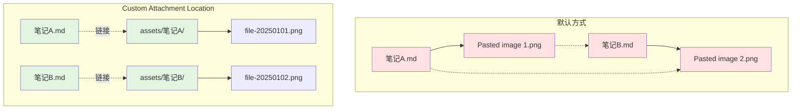

# 第三方插件详解

> 本部分详细介绍 Obsidian 中常用的第三方社区插件，包括图片管理、笔记导出、数据查询、模板增强等功能。

---

## 第九章：图片管理插件 —— Custom Attachment Location（第三方）

Obsidian 默认的图片粘贴功能有一个大问题：图片文件会散落在笔记同级目录，且使用非标准的 Wiki 链接语法。这不仅让文件管理混乱，还会导致在 GitHub 网页端或 VS Code 中无法显示图片。

### 9.1 问题的具体表现

当你在 Obsidian 中粘贴一张图片时，默认情况下：

1. 图片文件会保存在与笔记相同的文件夹中，文件名如 `Pasted image 20250101120000.png`
2. 笔记中插入的链接格式是 `[[Pasted image 20250101120000.png]]`（Wiki 链接）
3. 如果笔记多了、图片多了，文件夹会变得非常杂乱
4. 在 GitHub 网页端查看笔记时，图片显示为损坏链接
5. 用 VS Code 打开笔记时，图片也无法预览

### 9.2 解决方案概述

我们需要实现三个目标：
1. 图片按笔记分类存放，不杂乱
2. 使用标准 Markdown 图片链接 ``，兼容所有工具
3. 重命名或移动笔记时，图片自动跟随

**Custom Attachment Location** 插件可以完美解决这三个问题。

### 9.3 插件安装

1. 进入 **设置 → 第三方插件 → 浏览**
2. 搜索 **Custom Attachment Location**
3. 作者是 RainCat1998，下载量通常超过 10 万
4. 点击 **安装**，然后 **启用**
5. 进入 **设置 → 第三方插件 → Custom Attachment Location → 选项**

### 9.4 核心配置

按照以下步骤配置：

#### 步骤 1：设置附件存放位置

找到 **Attachment folder path**，输入：

```
assets/${noteFileName}
```

含义：
- 在 Vault 根目录创建 `assets` 文件夹
- 每个笔记对应一个子文件夹，子文件夹名与笔记名相同
- 该笔记的所有图片都存放在这个子文件夹中

#### 步骤 2：设置链接格式

找到 **Markdown URL 格式**，输入：

```
assets/${noteFileName}/${generatedAttachmentFileName}
```

这样生成的图片链接是标准 Markdown 格式：

```markdown

```

#### 步骤 3：设置文件命名规则

找到 **Generated attachment file name**，输入：

```
file-${date:YYYY-MM-DD-HHmmss}
```

这样图片会以时间戳命名，如 `file-2025-01-01-120000.png`，避免中文名和特殊字符导致的问题。

#### 步骤 4：开启附件重命名

找到 **Rename附件**，勾选以下选项：
- **Rename the attachment folder**：当笔记重命名时，自动重命名对应的附件文件夹
- **Update the link of the attachment**：当笔记移动或重命名时，自动更新图片链接

### 9.5 配合 Obsidian 系统设置

进入 **设置 → 文件与链接**：

1. 关闭 **使用 Wiki 链接**（确保使用标准 Markdown 链接）
2. **内部链接类型** 选择 **基于当前笔记的相对路径**
3. **新建笔记的存放位置** 按需设置
4. **附件默认存放路径** 保持默认或设为 `assets`

### 9.6 使用效果

**图片存储方式对比**：



配置完成后，当你粘贴一张图片：

1. 自动在 Vault 根目录创建 `assets` 文件夹
2. 在 `assets` 下创建与当前笔记同名的子文件夹
3. 图片以时间戳命名保存到该子文件夹
4. 笔记中插入标准 Markdown 链接

示例：

```
Vault/
├── 我的笔记.md
└── assets/
    └── 我的笔记/
        ├── file-2025-01-01-120000.png
        └── file-2025-01-01-121500.png
```

笔记内容：

```markdown
# 我的笔记

这是一张截图：


```

#### 重命名笔记测试

将 `我的笔记.md` 重命名为 `技术笔记.md`：

1. 文件夹 `assets/我的笔记` 自动重命名为 `assets/技术笔记`
2. 笔记内的图片链接自动更新为 `assets/技术笔记/...`

#### 跨工具验证

- 在 GitHub 网页端查看该笔记，图片正常显示
- 在 VS Code 中打开该笔记，图片正常预览
- 用任何 Markdown 编辑器打开，图片都可正常查看

### 9.7 图片尺寸调整

如果图片太宽，可以在方括号内输入数字来限制显示宽度：

```markdown

```

这样图片会以 500px 的宽度显示。

---

## 第十章：笔记导出插件 —— Enhancing Export（第三方）

Obsidian 的笔记是 Markdown 格式，但有时候你需要将笔记导出为 Word、PDF 或 HTML，以便分享或打印。Enhancing Export 插件基于强大的 Pandoc 工具，可以实现高质量的多格式导出。

### 10.1 插件介绍

Enhancing Export 是一个社区插件，它在 Obsidian 中集成了 Pandoc 文档转换工具，支持导出为以下格式：

- **Word**（.docx）：最常用的文档格式，适合发送给同事或老师
- **PDF**（.pdf）：适合打印和正式分发
- **HTML**（.html）：适合网页发布
- **ePub**（.epub）：适合电子书阅读器
- **LaTeX**（.tex）：适合学术排版
- **PowerPoint**（.pptx）：适合演示

### 10.2 安装 Pandoc

Enhancing Export 依赖 Pandoc，需要先单独安装。

#### Windows

1. 访问 https://github.com/jgm/pandoc/releases
2. 下载最新版本的 `pandoc-x.x.x-windows-x86_64.zip`
3. 解压到一个固定目录，如 `C:\Tools\pandoc`
4. 将解压后的 `pandoc.exe` 的路径记录下来

#### macOS

```bash
brew install pandoc
```

#### Linux

```bash
sudo apt-get install pandoc
```

### 10.3 安装 Enhancing Export 插件

1. 进入 **设置 → 第三方插件 → 浏览**
2. 搜索 **Enhancing Export**
3. 点击 **安装**，然后 **启用**
4. 进入 **设置 → 第三方插件 → Enhancing Export → 选项**

### 10.4 配置插件

在设置页面中：

1. **Pandoc Path**：填入 Pandoc 可执行文件的路径
   - Windows 示例：`C:\Tools\pandoc\pandoc.exe`
   - macOS/Linux：通常安装后自动在 PATH 中，留空即可

2. **Default Export Folder**：设置默认导出目录（可选）

3. 其他选项保持默认即可

### 10.5 导出笔记

#### 基本导出

1. 在文件列表中右键点击要导出的笔记
2. 选择 **导出为...**
3. 在弹出的窗口中选择目标格式
4. 选择保存位置
5. 点击 **导出**

#### 批量导出

你也可以导出整个文件夹或多篇笔记：

1. 选中多个笔记（按住 Ctrl/Cmd 多选）
2. 右键 → **导出为...**
3. 选择格式和保存位置

### 10.6 导出效果

导出为 Word 时：
- Markdown 标题会转换为 Word 的标题样式
- 表格会保留格式
- 图片会内嵌到文档中
- 代码块会保留等宽字体

导出为 PDF 时：
- 排版整洁，适合打印
- 会自动生成目录（如果笔记中有标题层级）

导出为 HTML 时：
- 生成独立的 HTML 文件
- 可以选择是否内嵌图片（生成单文件 HTML）

### 10.7 进阶：自定义导出模板

如果你对排版有更高要求，可以自定义 Pandoc 的导出模板：

1. 准备 Word 模板文件（.docx），设置好你想要的样式（字体、行距、页边距等）
2. 在导出命令中指定 `--reference-doc=模板文件.docx`
3. 这样导出的 Word 文档会使用你预设的样式

这需要一定的 Pandoc 命令行知识，适合有进阶需求的用户。

---

## 第十一章：其他常用第三方插件介绍与用法

### 11.1 插件管理基础

在进入具体插件之前，先了解一些插件管理的基本知识。

#### 核心插件 vs 社区插件

- **核心插件**：Obsidian 官方内置，在 **设置 → 核心插件** 中管理
- **社区插件**：由第三方开发者贡献，在 **设置 → 第三方插件** 中管理

#### 开启社区插件市场

首次使用社区插件时，需要关闭安全模式：

1. 进入 **设置 → 第三方插件**
2. 关闭 **安全模式** 开关
3. 点击 **浏览** 即可搜索和安装社区插件

#### 插件的安装、启用、更新与卸载

- **安装**：浏览市场中点击安装
- **启用**：安装后需要手动启用才会生效
- **更新**：有更新时，设置页面的插件旁会显示更新按钮
- **卸载**：在插件列表中点击插件，选择卸载

> 提示：社区插件由第三方维护，安装前建议查看下载量和用户评价。高下载量（如 10万+）的插件通常更可靠。

### 11.2 数据查询插件 —— Dataview

Dataview 是 Obsidian 社区中最强大的数据查询插件，被称为"Obsidian 中的数据库"。

#### 功能概述

Dataview 让你可以用类 SQL 的语法查询笔记的元数据（YAML 属性、标签、创建时间等），并生成动态列表或表格。

#### 安装

1. 在社区插件市场搜索 **Dataview**
2. 作者是 Michael Brenan，下载量通常超过 50 万
3. 安装并启用

#### 基础用法：DQL 查询

Dataview 使用 Dataview Query Language（DQL）。在笔记中插入一个代码块，语言指定为 `dataview`：

**列出所有带某标签的笔记**：

````markdown
```dataview
LIST
FROM #待办
```
````

**列出某文件夹下的所有笔记**：

````markdown
```dataview
LIST
FROM "项目"
```
````

**显示带属性的笔记为表格**：

假设你的笔记有 YAML 属性：

```yaml
---
status: 进行中
priority: 高
due: 2025-06-01
---
```

查询代码：

````markdown
```dataview
TABLE status, priority, due
FROM "项目"
WHERE status = "进行中"
SORT priority DESC
```
````

#### 典型应用场景

1. **项目看板**：汇总所有项目笔记，按状态筛选
2. **阅读清单**：汇总所有读书笔记，按评分排序
3. **待办汇总**：从 Daily Notes 中收集所有未完成的任务
4. **最近更新**：显示最近 7 天内修改过的笔记

#### 进阶功能

- **DataviewJS**：使用 JavaScript 编写更复杂的查询逻辑
- **Inline queries**：在正文中内联查询结果
- **Task queries**：专门查询任务列表，支持按完成状态筛选

Dataview 的学习曲线稍陡，但一旦掌握，可以大幅提升笔记的可用性。

### 11.3 模板增强插件 —— Templater

Obsidian 自带了模板功能，但比较基础。Templater 是一个更强大的动态模板系统。

#### 功能概述

Templater 允许你在模板中使用动态占位符，创建笔记时自动填充：
- 当前日期、时间
- 笔记标题
- 随机数
- 用户输入
- 甚至执行 JavaScript 代码

#### 安装

1. 在社区插件市场搜索 **Templater**
2. 作者是 SilentVoid13
3. 安装并启用

#### 基础用法

在模板文件中写入占位符：

```markdown
---
created: <% tp.file.creation_date() %>
modified: <% tp.file.last_modified_date() %>
tags: [日记]
---

# <% tp.file.title %>

## 今日待办
- [ ] 

## 今日记录


## 明日计划

```

创建笔记时选择这个模板，Templater 会自动将 `<% ... %>` 替换为实际值。

#### 与 QuickAdd 配合

Templater 常与 QuickAdd 插件配合使用：QuickAdd 负责"一键触发"，Templater 负责"填充内容"。

### 11.4 日历与日记插件 —— Calendar

Calendar 为 Obsidian 添加了一个可视化日历面板，方便管理每日笔记。

#### 功能概述

- 在右侧边栏显示月历
- 点击日期即可创建或打开当天的日记
- 有日记的日期会显示小圆点标记
- 支持周记、月记等多种日记模式

#### 安装与配置

1. 在社区插件市场搜索 **Calendar**
2. 作者是 Liam Cain
3. 安装并启用

配置项：
- **日记文件夹**：设置 Daily Notes 的存放位置
- **日记格式**：设置日记文件名格式，如 `YYYY-MM-DD`
- **周记**：是否启用周记功能

#### 使用场景

1. **习惯追踪**：每天在日记中记录习惯完成情况，通过日历直观看到连续记录
2. **每日复盘**：晚上在当天的日记中写复盘
3. **日程回顾**：点击任意日期，快速查看那天记录了什么

### 11.5 快速添加插件 —— QuickAdd

QuickAdd 让你可以通过快捷键或按钮快速执行预设操作，大幅提升效率。

#### 功能概述

QuickAdd 的核心理念是"Capture"（捕获）—— 快速将想法、任务、链接等捕获到笔记中，不打断当前工作流。

#### 安装

1. 在社区插件市场搜索 **QuickAdd**
2. 作者是 Christian B. B. Houmann
3. 安装并启用

#### 典型用法

**一键创建新笔记**：

1. 在 QuickAdd 设置中创建一个 "Choice"
2. 选择 "Template" 类型
3. 指定模板文件和目标文件夹
4. 设置一个快捷键（如 `Ctrl/Cmd + Shift + 1`）
5. 按下快捷键，输入笔记标题，自动按模板创建笔记

**快速添加待办**：

1. 创建一个 "Capture" 类型的 Choice
2. 目标设为当天的日记文件中的待办列表
3. 设置快捷键
4. 随时按下快捷键，输入任务内容，自动追加到日记中

**快速记录灵感**：

1. 创建一个 "Capture" 指向 Inbox 笔记
2. 设置快捷键
3. 任何时候有想法，一键记录，稍后统一整理

### 11.6 其他实用插件推荐

| 插件名 | 功能 | 适用场景 |
|--------|------|----------|
| **Recent Files** | 在左侧显示最近打开的笔记 | 快速回到刚才的笔记 |
| **Outliner** | 大纲编辑增强，支持折叠、拖拽、缩进 | 写大纲、做清单 |
| **Excalidraw** | 手绘风格画图 | 流程图、思维导图、示意图 |
| **PDF Plus** | PDF 标注与笔记链接 | 读论文、做文献笔记 |
| **Mind Map** | 将 Markdown 大纲转为思维导图 | 整理思路 |
| **Admonition** | 创建彩色的提示框（警告、提示、注意等） | 美化笔记、突出重点 |
| **Breadcrumbs** | 添加面包屑导航，显示笔记层级 | 结构化知识库 |
| **Supercharged Links** | 根据属性给链接添加图标和颜色 | 快速识别链接类型 |

安装方法相同：在社区插件市场搜索名称，安装并启用。

> **下一部分**：[AI 接入与智能化工作流](05-AI接入.md)
>
> 当你已经熟练掌握了 Obsidian 的核心功能和插件生态后，可以进一步探索 AI 与笔记的联动。我们将介绍如何通过 Gemini CLI 等 AI 编程工具，让 AI 直接操作你的本地 Markdown 笔记，实现智能选题、批量文件处理、模仿文风写作等高级玩法，同时利用 Git 保障 AI 操作的安全性。
