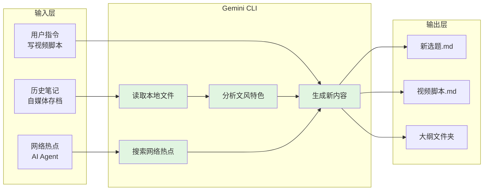

# AI 接入与智能化工作流

> 本部分介绍如何通过 AI 编程工具与 Obsidian 联动，实现智能化的知识管理工作流。

---

## 第十二章：AI 接入与智能化工作流（第三方工具）

Obsidian 本身不提供 AI 功能，但由于笔记是纯本地的 Markdown 文件，它与 AI 工具的兼容性非常好。本节介绍如何通过 AI 编程工具与 Obsidian 联动，实现智能化的知识管理工作流。

### 12.1 为什么用 AI 编程工具而非社区 AI 插件

Obsidian 社区也有一些 AI 插件（如 Copilot、Smart Connections 等），但相比直接使用 AI 编程工具，有以下不足：

| 对比项 | 社区 AI 插件 | AI 编程工具（如 Gemini CLI） |
|--------|-------------|------------------------------|
| 出品方 | 个人开发者 | Google、Anthropic 等一线大厂 |
| 模型质量 | 通常只支持单一模型 | 支持顶级模型，持续更新 |
| 文件操作 | 受限，通常在沙箱中 | 直接操作本地文件系统 |
| 功能丰富度 | 局限于插件设计的功能 | 几乎无限，取决于你的想象力 |
| 费用 | 部分收费 | 多数有免费额度 |

AI 编程工具的核心能力就是"理解自然语言指令，操作本地文件"。而 Obsidian 的笔记恰恰是本地 Markdown 文件，两者天然契合。

### 12.2 Gemini CLI 安装与配置

Gemini CLI 是 Google 推出的命令行 AI 工具，可以直接在终端中与 Gemini 模型对话，并让它操作本地文件。

#### 安装 Node.js

Gemini CLI 依赖 Node.js，先确保已安装：

```bash
node --version
```

如果显示版本号（如 v20.x.x），说明已安装。如果未安装：

- 访问 https://nodejs.org 下载对应系统的安装包
- 或使用包管理器安装

#### 安装 Gemini CLI

在终端中执行：

```bash
npm install -g @google/gemini-cli
```

#### 首次启动与授权

1. 打开终端，进入你的 Obsidian Vault 目录：

```bash
cd /path/to/your/vault
```

2. 启动 Gemini CLI：

```bash
gemini
```

3. 选择 **Login with Google** 进行授权
4. 按照提示在浏览器中完成登录
5. 授权成功后，Gemini CLI 就可以访问你的 Vault 中的文件了

#### 基本用法

在 Gemini CLI 中，你可以直接输入自然语言指令：

```
> 请帮我整理这个文件夹中的所有笔记，按主题分类
```

```
> 根据"自媒体存档"文件夹中我的写作风格，帮我写 5 个新的视频选题
```

```
> 帮我把"选题.md"中的内容拆分成多个独立的笔记文件
```

### 12.3 进阶玩法案例

#### 案例一：智能选题

假设你有一个 "自媒体存档" 文件夹，里面存放了过去几年的所有视频脚本。你可以让 Gemini 分析这些脚本，生成新的选题。

操作步骤：

1. 在终端中进入 Vault 根目录
2. 启动 Gemini CLI
3. 输入指令：

```
> "自媒体存档"文件夹里是我过去写的所有视频脚本。
> 请分析我的选题特色和行文风格，结合当前网络热点，
> 帮我生成 10 个新的视频选题。
> 每个选题包含标题、简介和大纲。
> 将结果输出到"新选题.md"文件中。
```

Gemini 会：
1. 读取 "自媒体存档" 文件夹中的所有文件
2. 分析你的写作风格和热门主题
3. 调用网络搜索获取当前热点
4. 生成 10 个选题
5. 将结果写入 "新选题.md"

#### 案例二：批量文件处理

假设你有一篇长文 "年度总结.md"，想按章节拆分成多个独立的笔记。

```
> 请将"年度总结.md"按二级标题拆分成多个独立笔记，
> 每个笔记以二级标题命名，存放到"2025年度总结"文件夹中。
```

Gemini 会自动：
1. 读取原文件
2. 识别所有二级标题
3. 创建目标文件夹
4. 将每个章节保存为独立文件
5. 在原文位置用链接替换内容

#### 案例三：模仿文风写作

你可以让 Gemini 学习你的文风，然后模仿这种风格写新的内容。

```
> 请阅读"自媒体存档/2024"和"自媒体存档/2025"文件夹中的内容，
> 学习我的行文风格。
> 然后搜索最近关于"AI Agent"的热门话题，
> 模仿我的风格写一篇详细的视频脚本，
> 输出到"AI-Agent-视频脚本.md"中。
```

**AI 与 Obsidian 协作工作流**：



### 12.4 Git 保障 AI 操作安全

用 AI 批量操作文件时，最令人担心的就是"AI 搞坏了我的笔记怎么办"。

如果你的 Vault 已经配置了 Git 同步（见第八章），这个问题就迎刃而解了：

**每一次修改都被记录**：
- AI 创建、修改、删除文件，都会被 Git 追踪
- 你可以随时查看"AI 做了什么"

**随时回滚**：
- 如果 AI 的操作结果不满意，在 GitHub Desktop 中点击 "Discard changes" 即可恢复到之前的状态
- 或者使用命令行：`git checkout -- 文件名`

**放心让 AI 工作**：
- 有了 Git 的保障，你可以大胆地让 AI 执行批量操作
- 即使出错，损失也只是一个 commit，随时可以撤销

### 12.5 更多 AI 工具选择

除了 Gemini CLI，你还可以尝试：

| 工具 | 出品方 | 特点 |
|------|--------|------|
| **Claude Code** | Anthropic | Claude 3.5/4 模型，代码能力强 |
| **Aider** | 开源社区 | 专为编程设计，支持多文件编辑 |
| **Continue** | 开源社区 | VS Code 插件，可在编辑器中直接与 AI 对话 |
| **Hyperlink** | 开源社区 | 本地运行 AI 模型，完全离线，保护隐私 |

这些工具的操作逻辑类似：在终端或编辑器中输入自然语言指令，AI 直接读写本地文件。

> **下一部分**：[附录](06-附录.md)
>
> 教程的最后一部分整理了本系列涉及的所有插件清单、配套工具下载地址、常用快捷键速查表，以及 Git 冲突解决、同步失败排查、插件性能优化等常见问题的解答。建议收藏备查。
