# 附录

> 本部分包含插件清单、配套工具、快捷键速查和常见问题解答。

---

## 附录

### 附录 A：本教程涉及的所有插件清单

| 插件名 | 类型 | 用途 | 推荐度 |
|--------|------|------|--------|
| 日记 | 自带核心插件 | 快速创建每日笔记 | ⭐⭐⭐⭐⭐ |
| 模板 | 自带核心插件 | 基于模板创建标准化笔记 | ⭐⭐⭐⭐⭐ |
| 快速切换 | 自带核心插件 | 快速打开笔记 | ⭐⭐⭐⭐⭐ |
| 星标 | 自带核心插件 | 收藏常用笔记 | ⭐⭐⭐⭐ |
| 工作区 | 自带核心插件 | 保存和恢复面板布局 | ⭐⭐⭐⭐ |
| 命令面板 | 自带核心插件 | 快捷操作入口 | ⭐⭐⭐⭐⭐ |
| 书签 | 自带核心插件 | 标记重要笔记和搜索条件 | ⭐⭐⭐⭐ |
| 发布 | 自带核心插件 | 笔记发布为公开网页 | ⭐⭐⭐ |
| 反向链接 | 自带核心插件 | 查看链接到当前笔记的笔记 | ⭐⭐⭐⭐⭐ |
| 标签面板 | 自带核心插件 | 管理所有标签 | ⭐⭐⭐⭐ |
| Git | 第三方社区插件 | 自动云同步（电脑端 + 手机端） | ⭐⭐⭐⭐⭐ |
| Custom Attachment Location | 第三方社区插件 | 图片标准化管理 | ⭐⭐⭐⭐⭐ |
| Enhancing Export | 第三方社区插件 | 多格式导出 | ⭐⭐⭐⭐ |
| Dataview | 第三方社区插件 | 数据查询与动态列表 | ⭐⭐⭐⭐⭐ |
| Templater | 第三方社区插件 | 动态模板系统 | ⭐⭐⭐⭐⭐ |
| Calendar | 第三方社区插件 | 日历与日记管理 | ⭐⭐⭐⭐ |
| QuickAdd | 第三方社区插件 | 快速添加与一键操作 | ⭐⭐⭐⭐⭐ |
| Recent Files | 第三方社区插件 | 最近文件 | ⭐⭐⭐⭐ |
| Outliner | 第三方社区插件 | 大纲编辑增强 | ⭐⭐⭐⭐ |
| Excalidraw | 第三方社区插件 | 手绘风格画布 | ⭐⭐⭐⭐ |
| PDF Plus | 第三方社区插件 | PDF 标注与链接 | ⭐⭐⭐⭐ |

### 附录 B：配套工具清单

| 工具名 | 用途 | 下载地址 |
|--------|------|----------|
| GitHub / GitHub Desktop | 云端仓库与同步 | https://desktop.github.com |
| Gemini CLI | AI 编程助手 | `npm install -g @google/gemini-cli` |
| Pandoc | 文档格式转换 | https://github.com/jgm/pandoc/releases |
| Node.js | Gemini CLI 运行环境 | https://nodejs.org |

### 附录 C：常用快捷键速查

| 快捷键 | 功能 |
|--------|------|
| `Ctrl/Cmd + P` | 命令面板 |
| `Ctrl/Cmd + O` | 快速切换笔记 |
| `Ctrl/Cmd + N` | 新建笔记 |
| `Ctrl/Cmd + E` | 切换编辑/预览模式 |
| `Ctrl/Cmd + Shift + F` | 全局搜索 |
| `Ctrl/Cmd + 点击链接` | 在新面板打开笔记 |
| `Ctrl/Cmd + W` | 关闭当前面板 |
| `Ctrl/Cmd + ,` | 打开设置 |
| `Ctrl/Cmd + Shift + N` | 在当前面板下方新建面板 |
| `Alt + 左右方向键` | 前进/后退浏览历史 |

### 附录 D：常见问题与解决

#### Q1：Git 冲突怎么解决？

**原因**：两台设备同时修改了同一个文件的同一部分。

**解决**：
1. 在 GitHub Desktop 或终端中查看冲突文件
2. 打开冲突文件，找到冲突标记 `<<<<<<<`、`=======`、`>>>>>>>`
3. 手动编辑，保留想要的内容，删除冲突标记
4. 保存文件，Git 插件会自动检测到变更已解决
5. 重新提交

**预防**：
- 不要在两台设备上同时编辑同一篇笔记
- 编辑完一台设备后，确认同步完成再编辑另一台

#### Q2：同步失败怎么办？

**排查步骤**：
1. 检查网络连接（能否访问 GitHub）
2. 查看 Git 插件状态栏提示，确认错误信息
3. 尝试手动 Pull：命令面板 → "Git: Pull"
4. 如果提示本地有未提交的变更，先手动 Commit
5. 检查 `.gitignore` 是否配置正确

#### Q3：插件安装后 Obsidian 变卡了？

**原因**：部分插件会监听所有文件变化，当笔记数量很多时会导致性能下降。

**解决**：
1. 进入 **设置 → 第三方插件**
2. 逐个禁用插件，观察哪个插件导致卡顿
3. 对于不需要的插件，直接卸载
4. 对于必需的插件，查看是否有性能优化选项

#### Q4：笔记多了之后打开变慢？

**优化建议**：
1. 减少 Vault 中的图片和视频等大文件数量
2. 关闭不需要的核心插件
3. 限制关系图谱的显示节点数量
4. 定期归档旧笔记到单独的 Archive Vault
5. 考虑将大型 Vault 拆分为多个主题 Vault

#### Q5：Wiki 链接和标准 Markdown 链接怎么选？

**建议**：
- 如果你只在 Obsidian 中使用笔记：Wiki 链接更方便（自动补全、预览）
- 如果你需要在 GitHub、VS Code、博客等其他平台查看笔记：**必须使用标准 Markdown 链接**
- 本教程推荐关闭 Wiki 链接，因为笔记的可迁移性比便利性更重要

---

> **结语**
>
> Obsidian 是一个需要"投入时间学习"的工具，但这份投入是值得的。从最初的 Markdown 编辑，到双向链接的知识网络，再到插件生态的无限扩展，Obsidian 可以陪伴你从简单的笔记记录，成长为高效的知识管理者。
>
> 建议的学习路径：
> 1. 第一周：熟悉界面和 Markdown 语法，每天写几条笔记
> 2. 第二周：开始使用双向链接，尝试链接不同的笔记
> 3. 第三周：配置 Git 同步，确保数据安全
> 4. 第一个月：探索几个核心插件（Dataview、Templater 等）
> 5. 持续：建立适合自己的笔记组织方法论（PARA、MOC、原子笔记）

**学习路径时间线**：

```mermaid
gantt
    title Obsidian 学习路径
    dateFormat X
    axisFormat %s周

    section 第一个月
    熟悉界面与Markdown语法     :a1, 0, 1
    使用双向链接               :a2, 1, 2
    配置Git同步                :a3, 2, 3
    探索核心插件               :a4, 3, 4

    section 持续进阶
    建立PARA分类体系           :b1, after a4, 6
    创建MOC内容地图            :b2, after b1, 8
    实践原子笔记法             :b3, after b2, 10
    接入AI智能化工作流         :b4, after b3, 12
```

>
> 最重要的是：**开始写**。再好的工具和方法，不用起来就没有价值。祝你在 Obsidian 中构建出属于自己的知识宇宙。

---

## 本教程完整导航

| 序号 | 文件 | 内容 |
|------|------|------|
| 01 | [基础入门](01-基础入门.md) | Obsidian 介绍、安装、界面、设置、笔记管理、Markdown 语法 |
| 02 | [核心功能与方法论](02-核心功能与方法论.md) | 双向链接、知识图谱、Canvas、工作区、PARA、MOC、原子笔记 |
| 03 | [Git 云同步](03-Git云同步.md) | GitHub 仓库、Git 插件、电脑端+手机端同步、备份策略 |
| 04 | [第三方插件](04-第三方插件.md) | 图片管理、笔记导出、Dataview、Templater、Calendar、QuickAdd |
| 05 | [AI 接入](05-AI接入.md) | Gemini CLI、智能选题、批量处理、文风模仿、AI 安全 |
| 06 | [附录](06-附录.md) | 插件清单、配套工具、快捷键、常见问题 |
